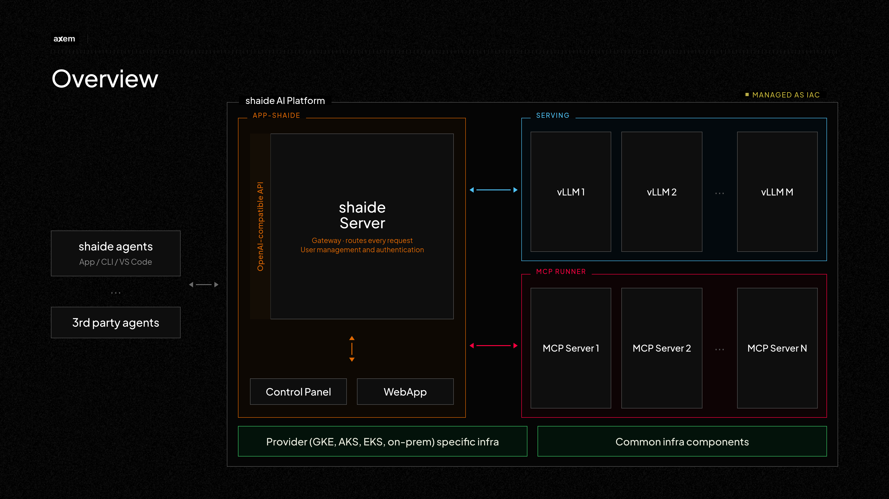

# Architecture overview



## Layers

| Layer | Contents |
| --- | --- |
| **Platform services** | Internal OCI registry; Istio and Gateway API |
| **Serving** | Per-model vLLM stacks orchestrated by llm-d, behind an inference gateway |
| **Application** | shaide server (API, auth, users) and the control panel |
| **Packages** | Installer, observability stack, shared libraries |

Each layer is an independent Pulumi program.

## Deployment order

```
1. Internal OCI registry       infra/cloud-harbor
2. Gateway + Istio             infra/gateway-provider
3. Model serving               app_serving
4. Application layer           app_shaide
5. Optional add-ons            app_mcp, monitoring
```

The installer performs all five.

## Request path

```
client → ingress → shaide server → inference gateway → GAIE → model replica
```

Embedding requests go directly from the shaide server to the embedding service,
bypassing the gateway.

Detail: [Architecture](../architecture/overview.md).
