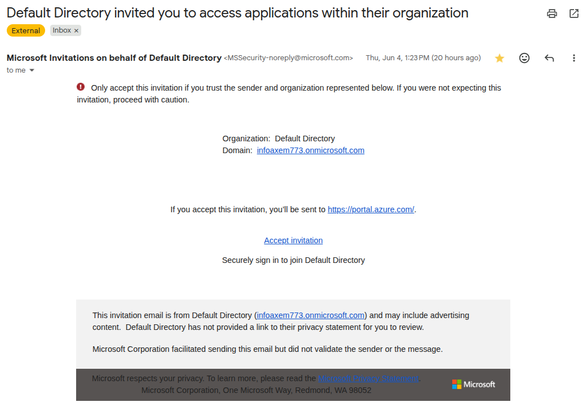
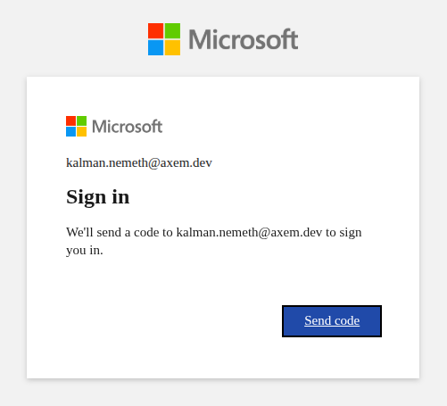
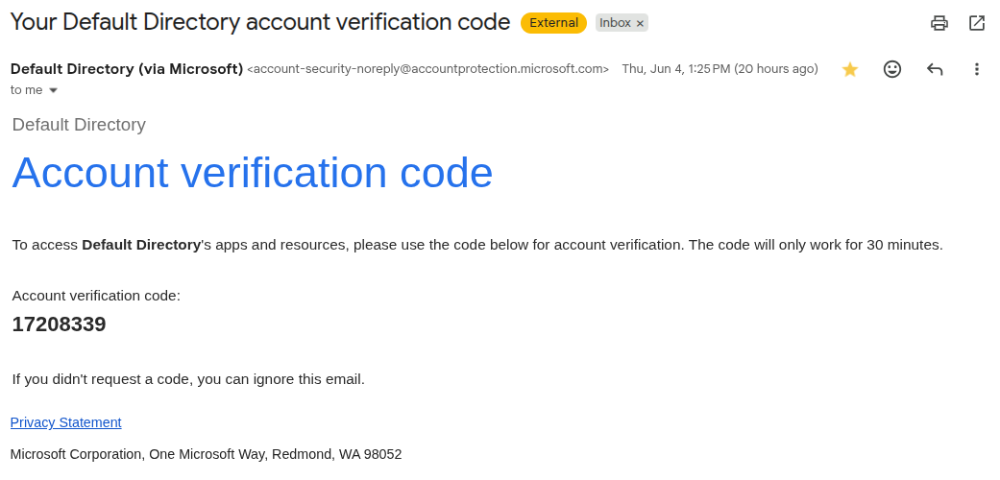
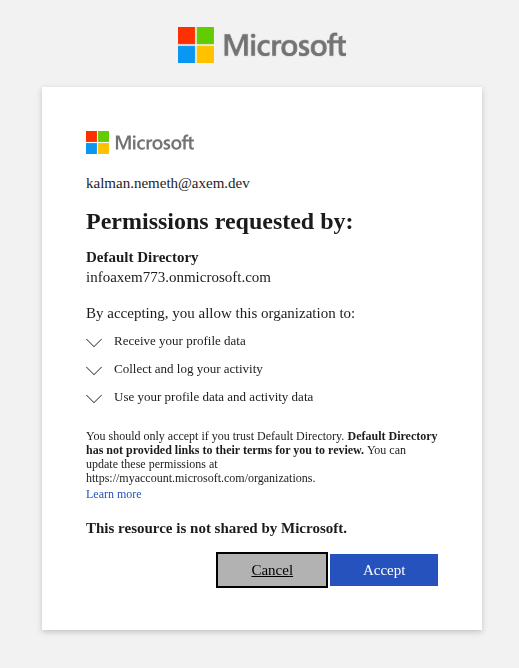
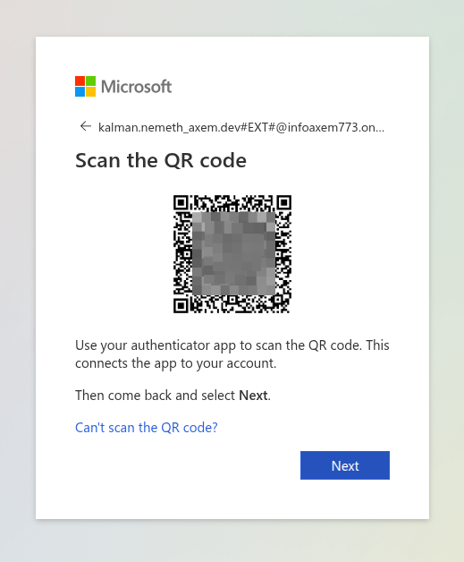

# Azure B2B login

This manual explains how users sign in to the Axem Azure tenant from a browser
and from the Azure CLI.

The tenant uses Microsoft Entra B2B collaboration. When a user accepts the
invitation, Azure registers the user's existing `axem.dev` identity as a guest
in the `infoaxem773.onmicrosoft.com` tenant. The user continues to authenticate
with the existing `axem.dev` credentials. No separate password is created or
stored in the `infoaxem773.onmicrosoft.com` tenant.

## Scope

Use this procedure for:

- Accepting the initial Azure B2B invitation.
- Signing in to the Azure portal.
- Registering multi-factor authentication (MFA).
- Signing in with the Azure CLI.
- Verifying the active Azure tenant and subscription.

## Tenant Details

| Item | Value |
|---|---|
| Tenant domain | `infoaxem773.onmicrosoft.com` |
| Tenant ID | `3dc2ba8f-cbbe-4bf8-91cc-84fae365dfad` |
| Portal URL | `https://portal.azure.com/infoaxem773.onmicrosoft.com` |
| Default subscription name | `Azure subscription 1` |
| Default subscription ID | `798052f0-f1e0-43aa-99d3-2a60a98801f2` |

## Prerequisites

Before starting, make sure you have:

- An Azure B2B invitation for the `infoaxem773.onmicrosoft.com` tenant.
- Access to the mailbox where the invitation was sent.
- Your `axem.dev` account credentials.
- An MFA method accepted by the tenant policy. Use the method Azure prompts for
  during registration. This is usually Microsoft Authenticator, but a
  standards-based Time-based One-Time Password (TOTP) application may also be
  accepted when tenant policy allows it.
- For CLI access, Azure CLI installed locally.

## Initial Setup: Accept Invitation

### 1. Open the Azure Invitation

Open the invitation email and select **Accept invitation**.



The browser redirects to Microsoft sign-in. Use the account that received the
invitation, for example your `axem.dev` user account.

### 2. Verify Your Account

Microsoft may send a verification code during the first sign-in.



Open the mailbox for the invited account, copy the verification code, and enter
it in the browser.



Complete the verification step before continuing.

### 3. Review and Accept Permissions

After successful account verification, Azure asks for consent to access the
inviting tenant as a guest user.



Review the permission request and select **Accept**.

### 4. Register MFA

Azure requires MFA registration for this tenant.



Use the MFA method Azure prompts for. A standards-based TOTP application can
also be used when permitted by the tenant policy.

Complete the MFA registration flow and confirm that the generated code is
accepted.

## Portal Login

After the invitation and MFA setup are complete, use the tenant-specific portal
URL:

```text
https://portal.azure.com/infoaxem773.onmicrosoft.com
```

This URL opens the Azure portal in the correct tenant context.

After signing in, verify the selected tenant:

1. Open the account menu in the top-right corner of the Azure portal.
2. Confirm that the current directory is `infoaxem773.onmicrosoft.com`.
3. If another directory is selected, switch directories and select
   `infoaxem773.onmicrosoft.com`.

## Azure CLI Login

Use tenant-scoped login so the CLI selects the correct Azure tenant.

```bash
az login --tenant infoaxem773.onmicrosoft.com
```

The CLI opens a browser window for authentication. Complete the login in the
browser using your `axem.dev` account and MFA.

If the browser does not open automatically, use device-code login:

```bash
az login --tenant infoaxem773.onmicrosoft.com --use-device-code
```

The command prints a device code and a Microsoft login URL. Open the URL in a
browser, enter the code, and complete authentication.

### Select the Subscription

After authentication, Azure CLI may ask which subscription and tenant to use.
Select the subscription for the Axem tenant:

| Subscription name | Subscription ID | Tenant ID |
|---|---|---|
| `Azure subscription 1` | `798052f0-f1e0-43aa-99d3-2a60a98801f2` | `3dc2ba8f-cbbe-4bf8-91cc-84fae365dfad` |

Subscription visibility requires Azure RBAC access. If login succeeds but this
subscription is not listed, the user account may not have access to the
subscription yet.

If needed, set the subscription explicitly:

```bash
az account set --subscription 798052f0-f1e0-43aa-99d3-2a60a98801f2
```

## Verify CLI Context

Run:

```bash
az account show
```

Expected shape:

```json
{
  "environmentName": "AzureCloud",
  "homeTenantId": "<user-home-tenant-id>",
  "id": "798052f0-f1e0-43aa-99d3-2a60a98801f2",
  "isDefault": true,
  "name": "Azure subscription 1",
  "state": "Enabled",
  "tenantId": "3dc2ba8f-cbbe-4bf8-91cc-84fae365dfad",
  "user": {
    "name": "<your-user>@axem.dev",
    "type": "user"
  }
}
```

The important fields are:

- `tenantId` must be `3dc2ba8f-cbbe-4bf8-91cc-84fae365dfad`.
- `id` must be `798052f0-f1e0-43aa-99d3-2a60a98801f2` when working in
  `Azure subscription 1`.
- Do not use `homeTenantId` to verify the selected Axem Azure tenant. For B2B
  guest users, `homeTenantId` reflects the user's home tenant, not
  `infoaxem773.onmicrosoft.com`. Use `tenantId` for that check.
- `user.name` must be your invited user account.

## Common Operations

List available subscriptions:

```bash
az account list --output table
```

Show the active subscription:

```bash
az account show --output table
```

Clear local Azure CLI login state only when needed:

```bash
az logout
```

This removes all local Azure CLI credentials, including sessions for other tenants.

Login again to the Axem tenant:

```bash
az login --tenant infoaxem773.onmicrosoft.com
```

## Troubleshooting

### Invitation Was Not Accepted

If the portal does not show the `infoaxem773.onmicrosoft.com` directory, open
the original invitation email and accept the invitation again. The account must
complete the invitation flow before it can access the tenant.

### Wrong Tenant Is Selected

Use the tenant-specific portal URL:

```text
https://portal.azure.com/infoaxem773.onmicrosoft.com
```

For CLI access, log in with the tenant argument:

```bash
az login --tenant infoaxem773.onmicrosoft.com
```

Then verify with:

```bash
az account show
```

### CLI Shows the Wrong Subscription

Set the subscription explicitly:

```bash
az account set --subscription 798052f0-f1e0-43aa-99d3-2a60a98801f2
```

Run `az account show` again and verify the `id` and `tenantId` values.

### CLI Shows No Subscriptions

If `az login` succeeds but Azure CLI does not list `Azure subscription 1`, first
confirm that authentication itself succeeded by logging in with
`--allow-no-subscriptions`:

```bash
az login --tenant infoaxem773.onmicrosoft.com --allow-no-subscriptions
```

If this succeeds and the account appears, the B2B identity is valid but the user
has not yet been granted Azure RBAC access. Verify that the user has been granted
Azure RBAC access to the subscription. Accepting the B2B invitation gives the
user access to the tenant, but it does not by itself grant access to every
subscription or resource.

### MFA Registration Fails

Confirm that the time on the phone or workstation running the MFA application is
synchronized automatically. TOTP codes are time-sensitive. If the tenant policy
requires a specific MFA method, use the method requested by Azure.

### Browser Login Works but CLI Login Fails

Use device-code login:

```bash
az login --tenant infoaxem773.onmicrosoft.com --use-device-code
```

If the CLI still fails, clear the local login state and authenticate again:

```bash
az logout
az login --tenant infoaxem773.onmicrosoft.com
```

## Support Information to Provide

When requesting help, include:

- The user account used for login.
- Whether the invitation was accepted successfully.
- Whether browser portal login works.
- Output from `az account show`, with sensitive fields reviewed before sharing.
- The exact error message from the Azure portal or Azure CLI.
